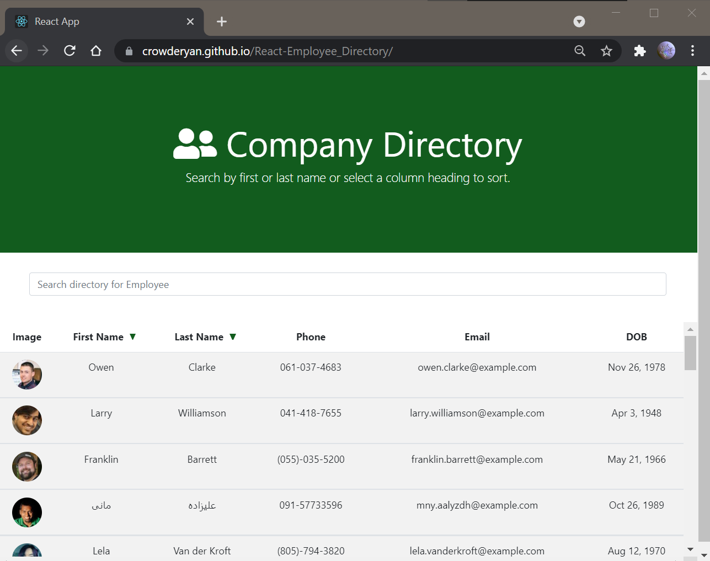
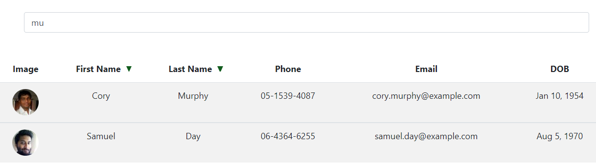
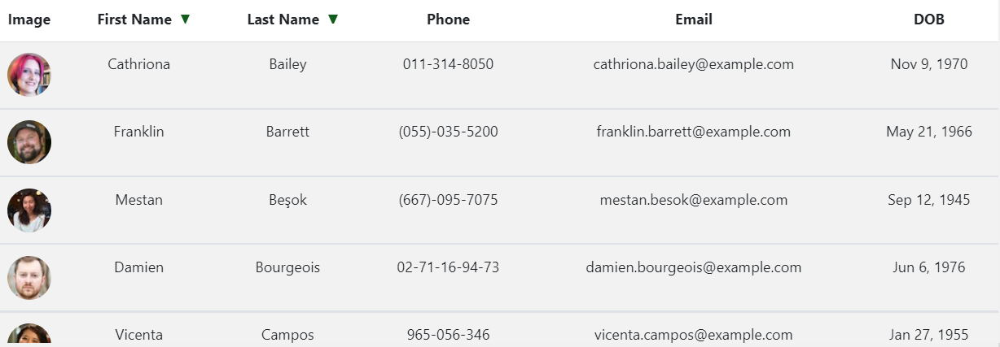
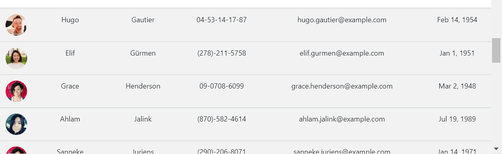

# #19 Employee Directory

## [App Deployed from GitHub](https://crowderyan.github.io/React-Employee_Directory/)

## Description:

# Installation:

    To find an Employee: Use the seachbar, the sort tabs, or simply scroll

# Usage:

## Search

## Sort

## Scroll

# Questions: https://github.com/Crowderyan

### Email me: <a href="mailto:Rebuiltrival@gmail.com" hspace="20">Rebuiltrival@gmail.com</a>
